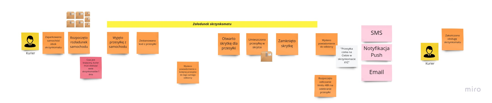
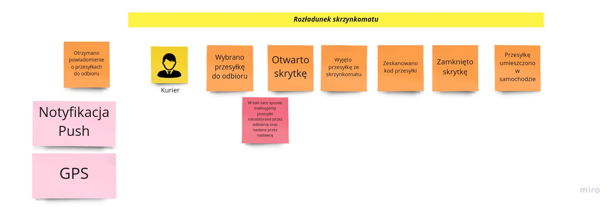
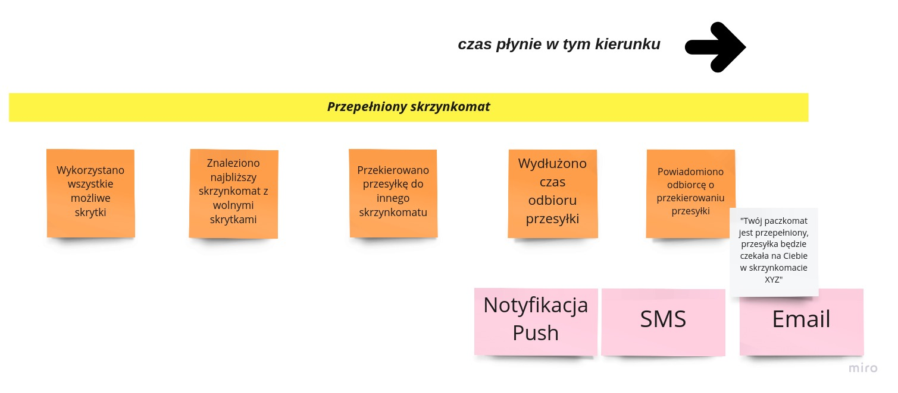
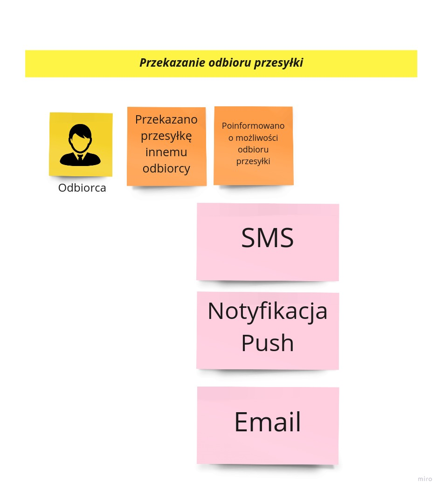
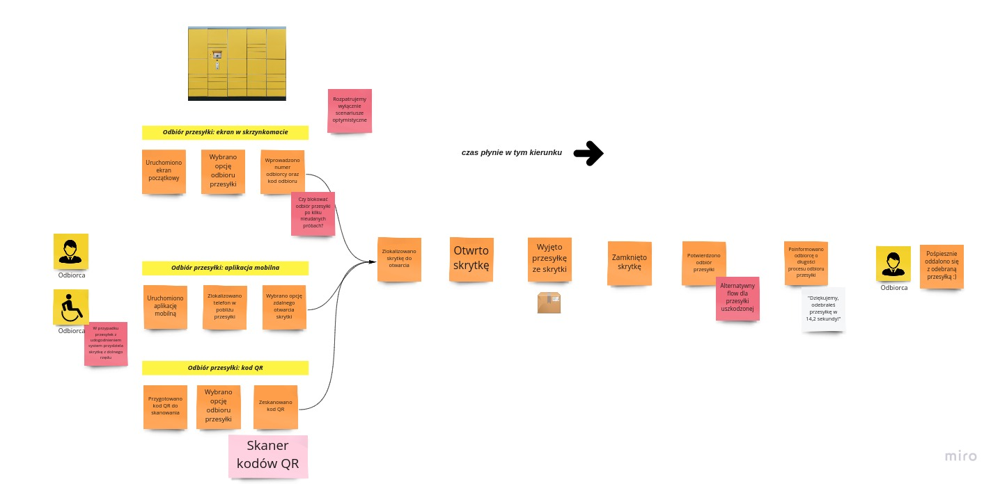
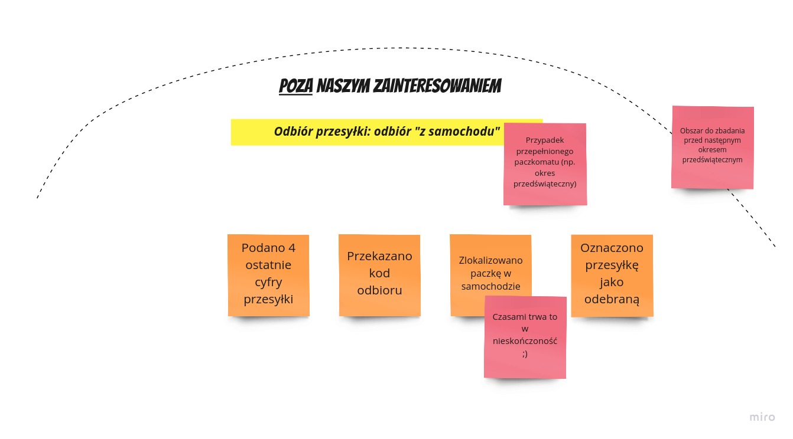
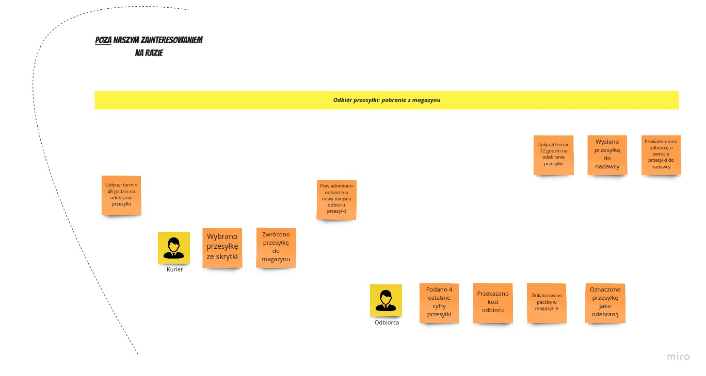

# Domain Explorers

# Spis treści

1. [O repozytorium](#o-repozytorium)
2. [Analiza domeny](#analiza-domeny)
  2.1 [Big Picture Event Storming](#big-picture-event-storming)

## O repozytorium

Ten projekt stanowi zapis analizy, modelowania oraz implementacji w ramach [Domain Explorers](https://explorers.bettersoftwaredesign.pl). Znajdziesz tutaj zarówno artefakty wynikowe poszczególnych sesji EventStormingu, modelowania, jak i (docelowo) powstałą na tej bazie implementację.

Celem projektu jest zdobywanie praktycznych umiejętności z zakresu modelowania systemów.

## Analiza domeny

### Big Picture Event Storming

W wielkim skrócie Event Stroming jest metodą odkrywania domeny biznesowej. Odkrywanie domeny odbywa się ramach spotkania ekpserów domentowych razem z ekspertami technicznymi. Artefakty po spotkaniu są kluczowe w dalcszym procesie modelowania systemu. Pozwalają okreslić domenty kluczowe, na których należy się skoncentrować oraz domeny poboczne i generyczne, które mają mniejszy wpływ na sukces biznesu, a co za tym idzie nie wymagają tak dużej uwagi.  Autorem metody jest Alberto Brandolini.

Więcej na temat Big Picture Event Storming można przeczytać w [artykule Radka Maziarki](https://radekmaziarka.pl/2018/12/10/event-storming-w-organizacji-big-picture/) oraz [kompedium wiedzy  Mariusza Gila](https://github.com/mariuszgil/awesome-eventstorming).

### Pierwsza iteracja:

Podczas pierwszej iteracji rozpoznaliśmy wstępnie domenę biznesową skrzynkomatów. Udało się zarysować pierwsze procesy. Kształ procesów może się zmienić w trakcie doszczegóławiania.

#### Załadunek skrzynkomatu:

#### Rozładunek skrzynkomatu

#### Przepełniony skrzynkomat

#### Przekazanie odbioru przesyłki

#### Odbiór przesyłki ze skrzynkomatu

#### Odbiór przesyłki "z samochodu"

#### Odbiór przesyłki z magazynu

  
Link do [Miro](https://miro.com/app/board/o9J_lUjTEuk=/)

#### Wersja finalna

TBD

#### Licencja

Ten projekt objęty jest licencją Apache 2.0. Kopiowanie i rozpowszechnianie kodu jest dozwolone (a wręcz wskazane)
